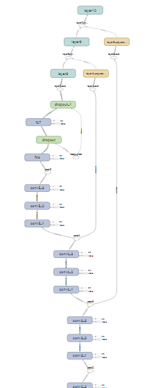
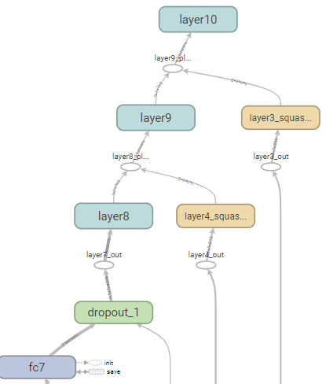
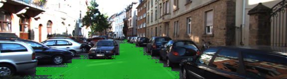
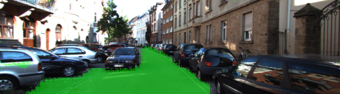
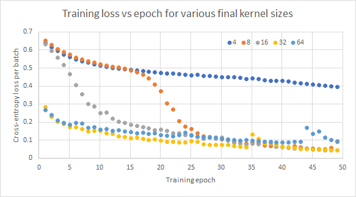

# Semantic Segregation Project

## History

Warning: this has now had a rewrite since I originally submitted it for my Udacity
course, to use the latest version of TensorFlow and Keras and now PyTorch
as an alternative. See history for original version.

## Original Details

Self-Driving Car Engineer Nanodegree Program

Author: Charlie Wartnaby, Applus IDIADA

Email: charlie.wartnaby@idiada.com

Version: 1.0

Date: 23Jun2018

## Notes against rubric

The functions load_vgg, layers, optimize and train_nn have all been implemented such that
the model successfully trains to identify road versus non-road pixels on the KITTI road dataset.
The loss of the network is printed during execution as required.

On average, the model loss decreases with time. The number of epochs is set such that the loss
is no longer decreasing significantly at the end. The batch size is set such that TensorFlow
does not emit a memory warning on the hardware used.

Unfortunately the KITTI test images do not have ground truth data to compare with, but
subjectively a high proportion of road pixels are successfully highlighted in the output,
and only a very small proportion of non-road pixels (false positives).

The project submission requires the files helper.py, main.py, project_tests.py and the 
inference images from the runs folder are included in a zip file, which is included here
as **semantic_segregation_submission_package.zip**. However, the source files are also
uploaded separately to make browsing them easier on github.

All unit tests pass.

Therefore all rubric points have been met.

## Programming Environment

The work was done on a high-end HP laptop with an NVIDIA Quadro P3000 GPU, which was able to
process an epoch in approximately one minute. The software ran under Windows 10 using the
provided Anaconda carnd-advdl-odlab environment from the optional object detection lab
including tensorflow-1.4.

Visual Studio 2017 with the optional Python functionality installed allowed that virtual
environment to be referenced, bringing the advantages of step-by-step debugging during
development.

## Template code changes

The provided unit test test_train_nn() required a fix for a VGG layer name from 
'input_image' to 'image_input'.

The helper function gen_batch_function() was left functionally unchanged, but I commented
it extensively to necessarily understand exactly how the disk images were handled and
converted into specific tensor sizes and their layout (NHWC, i.e. image, height, width,
colour channel).

## Model structure

### Understanding VGG layers to connect to

Initially it was difficult to understand the dimensions of the processed image as it
was passed through the VGG layers, and therefore how to correctly implement the
additional custom decoder layers.

Two techniques aided this understanding:
1. Calling tf.trainable_variables() to emit the sizes of the variables involved at each
   layer.
2. Using tf.summary.FileWriter() to output a logfile which could then be inspected
   using the graphical tensorboard tool.

```
        if True:  # Turned off for most runs when not debugging
            print(tf.trainable_variables()) # also trying to understand what we've got
            log_path = os.path.join(vgg_path, 'logs')
            writer = tf.summary.FileWriter(log_path, graph=sess.graph)
```

With the custom decoder layers successfully added, the overall model graph shows
the skip connections from selected VGG layers to the decoder (long vertical lines
on the right hand side):



The custom decoder layers for one experiment are shown here:



### Hyperparameter tuning

Batch size was constrained by the GPU hardware. With the final model structure, a batch
of 6 ran without any memory warning from TensorFlow, whereas a batch of 8 or larger did
prompt a warning that performance might be impaired by lack of memory.

Some brief experiments were made varying the dropout layer 'keep_prob' between 0.5 and 0.9.
An aggressive value of 0.5 seemed to allow the model to train to ultimately lower loss,
presumably avoiding overtraining.

Learning rate values between 0.0001 and 0.005 were tried; a value of 0.001 seemed to
perform reasonably.

50 epochs was sufficient for the loss to no longer be decreasing significantly.

### Decoder layer experiments and training loss trend

The original images were scaled by the template code to a size of 160x576 pixels.

The size of the image as it passed through the VGG encoder layers was understood
using Tensorboard (see above), ultimately arriving at layer7 with 5x18 pixels
(but a feature map depth of 4096).

For the decoder, the feature map was collapsed to a depth of just 2 classes, i.e.
road or non-road.

Note: the template code in helper.py:gen_batch_function() allocated both 'this'
road pixels and 'other' road pixels to the "road" class. This makes the data
somewhat more challenging for the model to learn than if only 'this' road pixels
were included. But as a result, we should expect to see it paint segments of road
other than the one directly in front of the camera.

The skip layer connections required adding to the VGG layer4 output (at 10x36 pixel
image size), and then the layer 3 output (at 20x72 pixels). In each case the VGG
output was first flattened to 2 classes to make it compatible with my own decoder
layers under the addition operator.

So finally an expansion
by 8 to get back to the original image size of 160x576 was required. Here I tried
various experiments:

Doing this in 3 steps each with a stride of 2 and a kernel size of 4 yielded very
poor results:


Expanding in 1 step of stride 8 but a kernel size of only 4 was a mistake, but the
output was interesting to see; because the kernel was smaller than the stride,
the network only painted a patchwork of pixels classified as road, with 4-pixel
gaps in between. However, the patches did correspond quite well to 'road':


Expanding in one step of stride 8 and kernel size 8 was quite successful, though the
areas painted as 'road' were rather blocky:



Expanding using a kernel of 16, and then 32, gave smoother results, the best
achieved here:




Finally trying a kernel size of 64 was too big; the painting of road pixels was
rather smeared out, and areas of non-road such as vehicles started to be painted
more:


The graph below shows the training loss as a function of epoch for the final-layer kernel
sizes from 4 to 64.



The numerical loss for 8, 16 and 32-pixel kernels were similar,
but subjectively the results were best with the 32-pixel kernel, so those results
were kept for project submission in the zip file.

## Conclusion

Semantic segregation of test images into two classes ('road' and 'non-road') was
successfully achieved using a fully convolutional neural network.

The method followed that of Long and Shelhamer[1] with their FCN-8 architecture.
The KITTI road dataset was used to provide labelled training images, and a separate
set of test images for final evaluation.

## References

[1] "Fully Convolutional Networks for Semantic Segmentation", Long, Shelhamer and Darrell,
UC Berkeley, 2015.